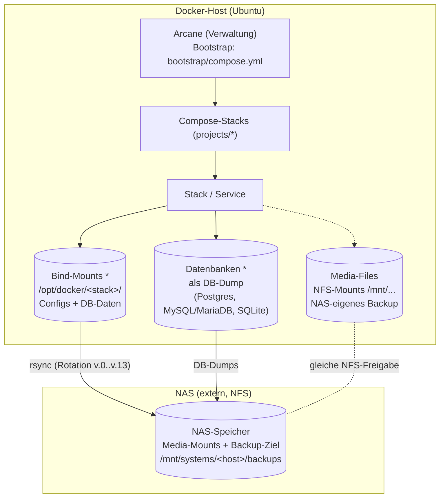

# arcane-docker-stack

Docker-Compose-Stacks und Backup-System für einen **Ubuntu-Docker-Host**.
Kernstück ist **Arcane** — die Verwaltungsoberfläche, unter der alle Stacks als Projekte laufen. Dieses Repo beschreibt, pflegt und sichert die gesamte Docker-Landschaft des Hosts.

> Arbeitssprache ist Deutsch. In-depth-Anleitungen (Deploy, Konfiguration, Services hinzufügen/entfernen, Backup, Restore) liegen in [`docs/`](docs/) — dieses README gibt den Überblick über Komponenten und Möglichkeiten.

## Komponenten

| Komponente | Ort | Zweck |
|---|---|---|
| **Arcane** (Verwaltung) | `bootstrap/compose.yml` (Repo) | Docker-Verwaltungsoberfläche; verwaltet alle Compose-Stacks als Projekte. **Selbst-Bootstrap**: Arcane kann sich nicht selbst verwalten — es läuft aus einem host-seitigen Compose-File (Repo: `bootstrap/compose.yml`, Host-Installation `/opt/docker/compose/compose.yml`, Projektname `base`). Daten als Bind-Mount unter `/opt/docker/arcane/` |
| **Compose-Stacks** | `projects/<stack>/` | Deklaration aller Services: `compose.yaml` + `.env.example`. Die echten `.env`-Dateien leben **nur auf dem Host** (`/opt/docker/arcane/projects/<stack>/.env`) — nie im Repo |
| **Backup-System** | `tools/backup/` | Auto-Discovery-Backup: sichert alle laufenden Container (Dateien + DB-Dumps) auf das NAS. Installiert nach `/opt/docker/tools/backup` via `install.sh` |
| **Docker-Maintenance** | `tools/maintenance/` | Host-Pflege: prune von ungenutzten Images, gestoppten Containern, Netzwerken und Volumes (bewusst, nicht rebuildbar — nie parallel zu Backups). Installiert nach `/opt/docker/tools/maintenance` |
| **Bootstrap (Arcane)** | `bootstrap/compose.yml` | Arcane-Bootstrap — von Hand zu pflegen (Secrets!), wird vom Installer **nicht** angefasst. Host: `/opt/docker/compose/compose.yml` (Projekt `base`) |
| **Dokumentation** | `docs/` | In-depth-Referenz: Deployment, Backup-Strategie, Restore, Inventar, Todos & Entscheidungen |

## Die Stacks (projects/)

| Stack | Services (Auswahl) | Zweck |
|---|---|---|
| — | arcane | Verwaltung aller Projekte (Kernstück). **Hinweis:** Arcane läuft **nicht** aus `projects/` (kein `projects/arcane`-Verzeichnis), sondern aus dem host-seitigen Compose-File `bootstrap/compose.yml` (Host: `/opt/docker/compose/compose.yml`, Projekt `base`) — es kann sich nicht selbst hosten („Bootstrap-Problem"). Der Container: `ghcr.io/getarcaneapp/arcane:latest`, Mounts auf `/opt/docker/arcane/data` und `/opt/docker/arcane/projects` |
| `arr-stack` | sonarr, radarr, lidarr, bazarr, prowlarr, sabnzbd, overseerr | PVR/Media-Automation |
| `media` | plex, tautulli, audiobookshelf, metube, calibre-web, codex, tdarr | Medienserver & -verarbeitung |
| `smarthome` | homeassistant, music-assistant, mosquitto, matter-server | Hausautomatisierung |
| `monitoring` | dashdot, uptime-kuma, grafana, shynet | Überwachung & Analytics |
| `local-ai` | litellm, crawl4ai, valkey, searxng | Selbstgehostete KI/LLM-Infrastruktur |
| `content` | homepage, 5etools | Statische Inhalte |
| `infra` | omada-controller, crowdsec | Netzwerk & Security |
| `web-proxy` | nginx, acme | Reverse-Proxy + TLS-Zertifikate |
| `forgejo` (+ Runner) | forgejo, forgejo-runner | Git-Hosting & CI |
| `ghost` | ghost, ghost-mysql, ghost-activitypub | Blog |
| `immich` | immich, immich_postgres | Foto-Management |
| `vaultwarden` | vaultwarden (SQLite) | Passwort-Manager |
| `castopod` | castopod_app, castopod_mariadb, castopod_redis | Podcast |
| `wanderer` | wanderer (app, db, search, web) | Routenplanung (Hiking) |
| `analytics` | shynet (analytics-db) | Web-Analytics |

**Konvention:** Jeder Stack hat ein `compose.yaml`. Nutzdaten liegen als Bind-Mounts unter `/opt/docker/<stack>/` (z.B. `/opt/docker/ghost/` für den gesamten ghost-Stack inkl. aller Services). Docker-Volumes werden **nie** für zu sichernde Daten genutzt; NAS-Mounts (`/mnt/...`) sind nie Backup-Quelle.

## Zusammenhänge (Diagramm)

Runtime-Sicht auf dem Docker-Host — welche Datenarten es pro Stack/Service gibt und was davon ins Backup fällt (`*` = gesichert):



- `*` = vom Backup-System gesichert. Bind-Mounts und Datenbanken pro Stack/Service sind optional — nicht jeder Service hat alle drei Datenarten.
- Media-Files liegen auf NAS-Mounts und sind **nicht** Bestandteil des Backups (NAS-eigenes Backup).

## Das Backup-System im Überblick

- **Auto-Discovery**: Findest du einen Mount, sicher ihn. Läuft eine DB, dump sie. Keine statischen Service-Deklarationen mehr.
- **Rotation**: rsnapshot-artig `v.0..v.13` mit Hardlink-Dedupe — Restore-Pfade bleiben stabil.
- **Policies für Ausnahmen**: `tools/backup/policy.conf` (globale Defaults, Allowlist `/opt/docker`) + `policies.d/` (z.B. `SVC_IGNORE=true` für Caches, `EXTRA_FILE_EXCLUDES` für rebuildbare Daten).
- **Restore-Test**: `test-restore.sh --all` spielt DB-Dumps in einen Wegwerf-Postgres — das Live-System wird nie berührt.
- **Versionierung**: `v1.0.0+#<PR-Nummer>` — die Build-Nummer wird von der GitHub Action bei jedem Merge automatisch nachgetragen.

Details: [`docs/BACKUP-STRATEGIE.md`](docs/BACKUP-STRATEGIE.md) · [`docs/RESTORE.md`](docs/RESTORE.md) · [`docs/DEPLOYMENT.md`](docs/DEPLOYMENT.md)

## Schnellstart

```bash
# Backup-System installieren (aus dem Repo-Klon!)
cd /opt/docker/arcane && sudo git pull
sudo tools/backup/install.sh --home /opt/docker/tools/backup \
     --stacks-dir /opt/docker/arcane/projects \
     --backup-root /mnt/systems/&lt;host&gt;/backups

# Testen
sudo /opt/docker/tools/backup/backup.sh --dry-run       # nichts schreiben, nur planen
sudo /opt/docker/tools/backup/backup.sh                 # echter Lauf
sudo /opt/docker/tools/backup/test-restore.sh --all     # Restore-Fähigkeit prüfen
```

### Nächtclicher Cron (auf dem Docker-Host, root-Crontab)

```cron
30 2 * * * /usr/bin/flock -n /tmp/backup-dispatcher.lock /opt/docker/tools/backup/backup.sh >> /var/log/backup-dispatcher.log 2>&1
```

- Läuft täglich um 02:30 Uhr
- `flock -n` verhindert Überlappungen (das Skript selbst lockt zusätzlich — doppelt abgesichert)
- Log landet in `/var/log/backup-dispatcher.log` (das Skript schreibt zusätzlich strukturiert nach `$BACKUP_ROOT/logs/`)

Einrichten mit `sudo crontab -e` und Zeile einfügen.

## Verzeichnisstruktur

```text
arcane-docker-stack/
├── AGENTS.md
├── projects/
│   ├── ghost/
│   ├── immich/
│   └── ...
├── tools/
│   ├── backup/
│   └── maintenance/
├── bootstrap/
│   └── compose.yml
└── docs/
```

- **projects/** — je Stack ein Verzeichnis (`compose.yaml`, optional `.env.example`), plus `env-details.md` (Secret-/Format-Konventionen)
- **tools/** — Host-Tools (Installer: `tools/backup/install.sh` → `/opt/docker/tools/`): `backup/` (Backup-System), `maintenance/` (Docker-Pflege)
- **bootstrap/** — Compose-File für den Arcane-Bootstrap (nicht Teil des Installers — enthält Secrets, von Hand zu pflegen; Host: `/opt/docker/compose/compose.yml`)
- **docs/** — In-depth-Dokumentation

## Doku-Verteilung (weniger Redundanz)

In-depth-Doku in `docs/`: [`DEPLOYMENT.md`](docs/DEPLOYMENT.md) (Installation, Cron) · [`BACKUP-STRATEGIE.md`](docs/BACKUP-STRATEGIE.md) (Strategie, Policies) · [`RESTORE.md`](docs/RESTORE.md) (Restore) · [`INVENTAR.md`](docs/INVENTAR.md) (Service-Inventar) · [`TODOS.md`](docs/TODOS.md) (offene Todos)

Regel: **README = Überblick, docs/ = Schritt für Schritt.**

## Zusammenarbeit

Siehe [`AGENTS.md`](AGENTS.md) — Ziel/Umgebung, Git/PR-Workflow, Versionierung, .env-Konventionen, Backup-Design und Stil sind dort verbindlich dokumentiert.
