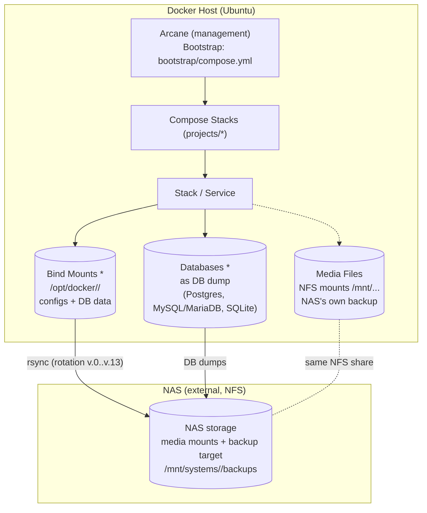

# homelab-docker-stack

Docker Compose stacks and backup system for a single **Ubuntu Docker host**. The centerpiece is **Arcane** — the management UI under which all stacks run as projects. This repo describes, maintains, and backs up the host's entire Docker landscape.

> Working language is English. In-depth guides (deploy, configuration, adding/removing services, backup, restore) live in [`docs/`](docs/) — this README provides the overview of components and capabilities.

## Components

| Component | Location | Purpose |
|---|---|---|
| **Arcane** (management) | `bootstrap/compose.yml` (repo) | Docker management UI; manages all compose stacks as projects. **Self-bootstrap**: Arcane cannot manage itself — it runs from a host-side compose file (repo: `bootstrap/compose.yml`, host installation `/opt/docker/compose/compose.yml`, project name `base`). Data as bind mounts under `/opt/docker/arcane/` |
| **Compose stacks** | `projects/<stack>/` | Declaration of all services: `compose.yaml` + `.env.example`. The real `.env` files live **on the host only** (`/opt/docker/arcane/projects/<stack>/.env`) — never in the repo |
| **Backup system** | `tools/backup/` | Auto-discovery backup: backs up all running containers (files + DB dumps) to the NAS. Installed to `/opt/docker/tools/backup` via `install.sh` |
| **Docker maintenance** | `tools/maintenance/` | Host housekeeping: prune of unused images, stopped containers, networks, and volumes (deliberate, not rebuildable — never in parallel with backups). Installed to `/opt/docker/tools/maintenance` |
| **Bootstrap (Arcane)** | `bootstrap/compose.yml` | Arcane bootstrap — maintained by hand (secrets!), never touched by the installer. Host: `/opt/docker/compose/compose.yml` (project `base`) |
| **Documentation** | `docs/` | In-depth reference: deployment, backup strategy, restore, todos |

## Stacks & Services (projects/)

**Terminology:**

- **Stack (= compose project)**: a directory under `projects/<stack>/` with a `compose.yaml` — a self-contained application (e.g. `ghost`). Arcane manages each stack as a compose project.
- **Service (= container)**: a single container within a stack (e.g. `ghost-mysql`). The `container_name` is what backup/restore expect as `--service`.

The concrete stack selection differs per host — the backup system uses **auto-discovery** and has no fixed service list. Exemplary (selection):

| Stack | Services (example) | Purpose | DB type |
|---|---|---|---|
| `ghost` | ghost, ghost-mysql, ghost-activitypub | Blog | MySQL |
| `media` | media servers & processing (several file services) | Media | SQLite (stop window) |
| `smarthome` | homeassistant, music-assistant, mosquitto, matter-server | Home automation | — |
| `web-proxy` | nginx, acme | Reverse proxy + TLS certificates | — |
| `vaultwarden` | vaultwarden | Password manager | SQLite (file backup via `sqlite3 .backup`) |

Other DB types used on this host: **Postgres** (e.g. photo management, AI infrastructure) and **MariaDB** (e.g. podcast) — discovery detects `postgres`, `mysql`/`mariadb`, and SQLite containers automatically.

**Note on Arcane:** Arcane does **not** run from `projects/` (there is no `projects/arcane` directory) but from the host-side compose file `bootstrap/compose.yml` (host: `/opt/docker/compose/compose.yml`, project `base`) — it cannot host itself (the "bootstrap problem"). Container: `ghcr.io/getarcaneapp/arcane:latest`, mounts on `/opt/docker/arcane/data` and `/opt/docker/arcane/projects`.

**Convention:** Every stack has a `compose.yaml`. Persistent data lives in bind mounts under `/opt/docker/<stack>/` (e.g. `/opt/docker/ghost/` for the entire ghost stack including all its services). Docker volumes are **never** used for data that needs backing up; NAS mounts (`/mnt/...`) are never a backup source.

## How it fits together (diagram)

Runtime view on the Docker host — which kinds of data exist per stack/service and which of them end up in the backup (`*` = backed up):



- `*` = backed up by the backup system. Bind mounts and databases per stack/service are optional — not every service has all three kinds of data.
- Media files live on NAS mounts and are **not** part of the backup (the NAS has its own backup).

## The backup system at a glance

- **Auto-discovery**: find a mount, back it up. Running database? Dump it. No static service declarations.
- **Rotation**: rsnapshot-style `v.0..v.13` with hardlink deduplication — restore paths stay stable.
- **Policies for exceptions**: `tools/backup/policy.conf` (global defaults, allowlist `/opt/docker`) + `policies.d/` (e.g. `SVC_IGNORE=true` for caches, `EXTRA_FILE_EXCLUDES` for rebuildable data).
- **Restore test**: `test-restore.sh` (no argument = all) replays DB dumps into throwaway containers (Postgres + MariaDB) — the live system is never touched.
- **Versioning**: `v1.0.0+#<PR number>` — the build number is appended automatically by the GitHub Action on every merge.

Details: [`docs/BACKUP-STRATEGY.md`](docs/BACKUP-STRATEGY.md) · [`docs/RESTORE.md`](docs/RESTORE.md) · [`docs/DEPLOYMENT.md`](docs/DEPLOYMENT.md)

## Quick start

```bash
# Install the backup system (from the repo checkout!)
cd /opt/docker/arcane && sudo git pull
sudo tools/install.sh --home /opt/docker/tools \
     --stacks-dir /opt/docker/arcane/projects \
     --backup-root /mnt/systems/<host>/backups

# Test
sudo /opt/docker/tools/backup/backup.sh --dry-run       # plan only, write nothing
sudo /opt/docker/tools/backup/backup.sh                 # real run
sudo /opt/docker/tools/backup/test-restore.sh            # verify restorability (all)
```

### Nightly cron (on the Docker host, root crontab)

```cron
30 2 * * * /opt/docker/tools/backup/backup.sh >> /var/log/backup-dispatcher.log 2>&1
```

- Runs daily at 02:30
- The script locks itself (`flock` on `/tmp/backup-dispatcher.lock`) — parallel runs are rejected; **no external `flock` wrapper** around the cron call (the same lockfile used externally and internally blocks itself)
- The log goes to `/var/log/backup-dispatcher.log` (the script additionally writes structured logs to `$BACKUP_ROOT/logs/`)

Set it up with `sudo crontab -e` and add the line.

## Directory structure

```text
homelab-docker-stack/
├── AGENTS.md
├── projects/
│   ├── ghost/
│   ├── immich/
│   └── ...
├── tools/
│   ├── install.sh
│   ├── backup/
│   └── maintenance/
├── bootstrap/
│   └── compose.yml
└── docs/
```

- **projects/** — one directory per stack (`compose.yaml`, optional `.env.example`)
- **tools/** — host tools (installer: `tools/install.sh` → `/opt/docker/tools/`): `backup/` (backup system), `maintenance/` (Docker housekeeping)
- **bootstrap/** — compose file for the Arcane bootstrap (not part of the installer — contains secrets, maintained by hand; host: `/opt/docker/compose/compose.yml`)
- **docs/** — in-depth documentation

## Documentation layout (less redundancy)

In-depth docs in `docs/`: [`DEPLOYMENT.md`](docs/DEPLOYMENT.md) (installation, cron) · [`BACKUP-STRATEGY.md`](docs/BACKUP-STRATEGY.md) (strategy, policies) · [`RESTORE.md`](docs/RESTORE.md) (restore) · [`TODOS.md`](docs/TODOS.md) (open todos). The real service inventory comes from auto-discovery: `backup.sh --discover`.

Rule: **README = overview, docs/ = step by step.**

## Security & trust assumptions

This is a single-host homelab setup. The following trust assumptions are a deliberate part of the design — if you cannot share them, you need encryption (see below):

- **`.env` files are stored unencrypted on the host** under `/opt/docker/arcane/projects/<stack>/.env` (containing DB passwords, API keys, secrets). Protection: file permissions (`chmod 600`), never in the repo (only `.env.example`), host access only via Arcane/SSH.
- **Backups are unencrypted** — in particular the DB dumps (`*.sql.gz`, `forgejo-dump.zip`, SQLite copies) contain all data in plaintext.
- **Assumed**: the Docker host (including root) and the NAS storage location (`/mnt/systems/<host>/backups`, NFS) are trusted; unauthorized access to host or NAS is outside the threat model.

**If you cannot or do not want to make these assumptions** (e.g. cloud backup, off-site copies, third-party storage), encrypt before storage — e.g. via Restic (`USE_RESTIC` hook in `lib/common.sh`, currently disabled) or an encrypted overlay (gocryptfs). This is not implemented today and not scheduled in [`TODOS.md`](docs/TODOS.md) — the effort would be a separate PR.

## Collaboration

See [`AGENTS.md`](AGENTS.md) — purpose/environment, Git/PR workflow, versioning, .env conventions, backup design, and style are documented there as binding rules.
